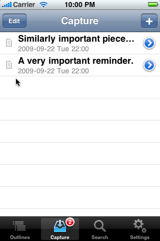

# Capturing Notes

MobileOrg allows you to capture notes whether you are online or
off. Notes are uploaded to the server during the next sync.

## How do I capture a new note?

To capture a new note, click on the *Capture* icon in the application
toolbar, then click the + icon in the navigation toolbar. Enter in
your note, then click Done.

The number of notes waiting to be synced appears as an indicator count
by the *Capture* toolbar icon. After you sync, this count disappears to
let you know you have no pending notes.

## Where do notes go after a sync?

Notes are appended to the end of the `mobileorg.org` file on your WebDAV
server. If this file does not exist when you try to sync, MobileOrg
will attempt to create it.

It is generally **NOT** recommended to reference `mobileorg.org` as a
link from your `index.org` file.

When you get back to your desktop computer, you can refile your
captured notes into your primary Org-mode files by following these
steps:

1) In Emacs, initiate a pull by typing `M-x org-mobile-pull RET`

2) The notes you captured in the MobileOrg app will be appended to a
file called `from-mobile.org in your default org directory (variable
*org-directory*). You may specify a different file and location by
explicitly setting the variable *org-mobile-inbox-for-pull*.

3) Refile your notes by switching to the `from-mobile.org` buffer, and
using `C-c C-w` Note that the changes you made to existing outline nodes
will simply be automatically applied by the `org-mobile-pull`
function. Those changes will only appear in `from-mobile.org` if they
could not be applied (e.g., if the target Org-file changed so much
that the context can no longer be located).

If you are not using the
[Org-mode integration](IntegratingWithOrgMode.md), you can disregard
these steps and manage the `mobileorg.org` file yourself using whatever
means you choose.
