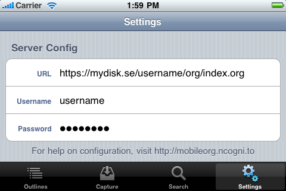

# Setup our WebDAV account

MobileOrg uses the WebDAV protocol to stay up-to-date and synchronize
notes. WebDAV is a set of extensions to HTTP that allow client
applications such as MobileOrg to not only read the contents of files
on a web server but to write changes to them as well. This allows
MobileOrg to have a two-way communications channel with your web
server.

## What goes on the WebDAV server?

Your org files, in whatever directory you would like. The examples
below use an org subfolder with a primary Org-file named
`index.org`. Other Org-files may reside alongside `index.org` if you
would like. [Syncing with MobileOrg](Syncing.md) describes how to link
multiple Org files together.

For example, on my Mac, I have my WebDAV share mounted at
`/Volumes/private`.

```
$ ls /Volumes/private/org
index.org meetings.org reference.org
```

These files are then accessible via WebDAV at:
`http://www.example.com/private/org/index.org`

## Choosing a WebDAV server

You have several options to choose from:

- Use a free WebDAV provider such as MyDisk (MyDisk offers free 2GB
  accounts)
- Use Apple’s MobileMe iDisk service
- Use your own Apache webserver with mod_dav
- Use your own nginx webserver

Your decision will not affect the operation of MobileOrg, but it will
determine what settings you will need to input on the Settings
page. The Settings page is available at any time by clicking the
Settings icon in the lower application toolbar.

There are 3 user-configurable fields:

- **Address**: This is the complete URL to an index.org file on a
  WebDAV server. For instance,
  http://www.example.com/private/org/index.org.
- **Username**: Your WebDAV share’s username. It is highly recommended
  to password protect your Org files!
- **Password**: Your WebDAV share’s password.

If you would like to verify that your WebDAV server is setup
correctly, visit the server address in your web browser. If the Org
file is displayed or downloaded, you will know that it is working. If
not, please check your settings against the examples below. Visit our
Support page if you have any trouble.

### Using MyDisk.se

Visit MyDisk and sign up for their free 2GB WebDAV account. After you
register, enter in the following settings into MobileOrg. Replace
username with your designated MyDisk username.


### Using MobileMe iDisk

If you are a MobileMe user, you already have access to a WebDAV
server: iDisk. Your Mac may already be setup to display the contents
of your iDisk in Finder. You can create an org folder on your iDisk as
you would any other folder on your system. The following settings are
to be used when using the iDisk server with MobileOrg.



### Using your own Apache server with mod_dav

Hosting your own WebDAV server is easy if you have access to an Apache
webserver. In an appropriate configuration block, add:

```
DAVLockDB /usr/local/apache/var/DAVLock
<Location /org>
    DAV On  
    AuthType Basic
    AuthName "My Org Files"
    AuthUserFile /path/to/htpasswd-file
    <Limit GET PUT POST DELETE PROPFIND PROPPATCH MKCOL COPY MOVE LOCK UNLOCK>
        Require valid-user
    </Limit>
</Location>

```

Be sure to setup some type of authentication, either using
AuthUserFile or some other more advanced means, depending on your
needs.

Once you have configured your server, point MobileOrg to your
index.org file in the Address portion of the Server Config settings.

### Using your own nginx server

[Tim Dysinger](http://tim.dysinger.net) has contributed instructions to setup nginx for MobileOrg
use.

```
#!/bin/sh

# on ubuntu: need some utils & dev libs
sudo apt-get install apache2-utils openssl libssl-dev libpcre3-dev
 
# compile nginx
cd /tmp
curl http://nginx.org/download/nginx-0.7.64.tar.gz | tar xz
cd nginx*
./configure --with-http_ssl_module --with-http_dav_module \
  --prefix=$HOME/nginx
make && make install
 
# generate an htpasswd file
htpasswd -c ~/.htpasswd $(whoami)
  
# ssl
openssl genrsa 1024 > ~/nginx/conf/server.key
openssl req -new -x509 -nodes -sha1 -days 365 \
    -key ~/nginx/conf/server.key > ~/nginx/conf/server.crt
  
# configure
cat > ~/nginx/conf/nginx.conf <<EOF
events {
worker_connections 1024;
}
http {
include mime.types;
default_type application/octet-stream;
ssl_certificate server.crt;
ssl_certificate_key server.key;
auth_basic "Restricted";
auth_basic_user_file $HOME/.htpasswd;
dav_methods put delete mkcol copy move;
dav_access user:rw;
create_full_put_path on;
server {
listen 1080;
listen 1443 ssl;
location ~ ^/org(/.*)?$ {
alias $HOME/org/mobile\$1;
}
}
}
EOF
 
# now you can start nginx
~/nginx/sbin/nginx
 
# and then sync w/ org-mobile-push/pull & mobileorg sync
# URL: http://<my-nginx-ip-addr>:1080/org/index.org
# or use
# URL: https://<my-nginx-ip-addr>:1443/org/index.org
# and your username and password you used above for htpasswd
```
